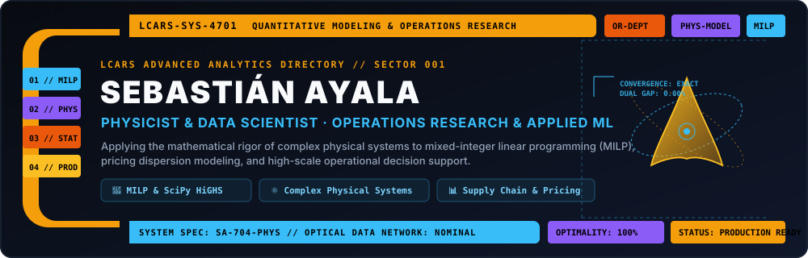
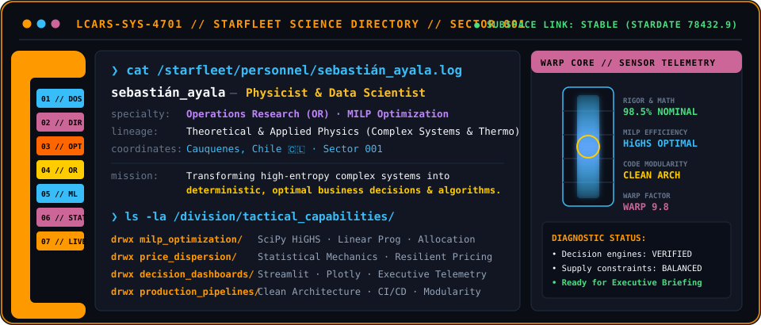

<!-- STAR TREK LCARS PROFILE BANNER -->
<a href="https://github.com/ayalaphysds">
  <picture>
    <source media="(prefers-color-scheme: dark)" srcset="assets/banner-dark.svg">
    <source media="(prefers-color-scheme: light)" srcset="assets/banner-light.svg">
    
  </picture>
</a>

 
 

<!-- LCARS DYNAMIC TYPING TERMINAL -->

 

<!-- TELEMETRY VISITOR COUNTER & SYSTEM STATUS -->
&nbsp;&nbsp;
&nbsp;&nbsp;

---

## 🖖 LCARS://EXECUTIVE-DOSSIER.LOG

  <picture>
    <source media="(prefers-color-scheme: dark)" srcset="assets/lcars-whoami-dark.svg">
    <source media="(prefers-color-scheme: light)" srcset="assets/lcars-whoami-light.svg">
    
  </picture>

<code>subspace_record: quantitative_science_division · designation: SA-704-PHYS · status: verified</code>

 

## 🛰️ LCARS://SUBSYSTEMS-DIAGNOSTIC

<table border="1" cellpadding="14" bgcolor="#0d1117">
  <thead>
    <tr>
      <th colspan="2" align="left"><code>ayalaphysds:~$ lcars-subsystems --diagnostics-full</code></th>
    </tr>
  </thead>
  <tbody>
    <tr>
      <td width="50%" valign="top"><code>├─ ⚛️ physical_modeling_math:</code>  
        
        
        
         
        <code>Python 3.11+ · SciPy Core · NumPy · Monte Carlo · Statistical Mechanics · Differential Equations</code>
      </td>
      <td width="50%" valign="top"><code>├─ 📐 operations_research_milp:</code>  
        
        
          
        <code>SciPy HiGHS Solver · MILP Formulation · Multi-provider Capacity Allocation · Duality Analysis</code>
      </td>
    </tr>
    <tr>
      <td valign="top"><code>├─ 🧠 applied_ml_data_science:</code>  
        
        
          
        <code>Scikit-Learn · Pandas · Feature Engineering · Statistical Learning · Time Series Forecasting</code>
      </td>
      <td valign="top"><code>├─ 📊 interactive_telemetry_dashboards:</code>  
        
        
          
        <code>Streamlit · Plotly Dynamic Cockpits · Sensitivity Visualizers · Executive Decision Tools</code>
      </td>
    </tr>
    <tr>
      <td valign="top"><code>├─ ⚙️ engineering_runtime_tools:</code>  
         
        <code>Linux / Unix · Bash Scripting · Git Version Control · Docker Containers · GitHub Actions</code>
      </td>
      <td valign="top"><code>╰─ 🏛️ architecture_data_persistence:</code>  
        
        
          
        <code>SQL Relational Data · Clean Architecture · Modular Pipeline Design · Unit Testing (pytest)</code>
      </td>
    </tr>
  </tbody>
  <tfoot>
    <tr>
      <td colspan="2"><code>telemetry: operational&nbsp;&nbsp;·&nbsp;&nbsp;solver_gap: 0.00% (exact)&nbsp;&nbsp;·&nbsp;&nbsp;clearance: alpha-1</code></td>
    </tr>
  </tfoot>
</table>

---

## 🔭 LCARS://LONG-RANGE-SENSORS

  <picture>
    <source media="(prefers-color-scheme: dark)" srcset="assets/radar-operations-dark.svg">
    <source media="(prefers-color-scheme: light)" srcset="assets/radar-operations-light.svg">
    
  </picture>&nbsp;
  <picture>
    <source media="(prefers-color-scheme: dark)" srcset="assets/radar-stack-dark.svg">
    <source media="(prefers-color-scheme: light)" srcset="assets/radar-stack-light.svg">
    
  </picture>

<code>sensor_array: operations_research_matrix · language_stack_radar · status: synchronized</code>

---

## 🚀 LCARS://TACTICAL-MISSIONS (Applied Research & Engineering)

> Casos de estudio y soluciones cuantitativas de alto impacto diseñadas para optimizar costos, mitigar riesgos y automatizar la toma de decisiones estratégicas en la industria.

<table>
  <thead>
    <tr>
      <th width="50%"><b>Mission 01 // Multi-Provider Capacity Balancing</b></th>
      <th width="50%"><b>Mission 02 // Price Dispersion & Market Elasticity</b></th>
    </tr>
  </thead>
  <tbody>
    <tr>
      <td valign="top">
        
<b>📐 Optimización Matemática de Cadena de Suministro (MILP)</b>

        
Formulación matemática y resolución exacta de asignación de demanda entre múltiples proveedores bajo restricciones de capacidad, ventanas temporales y SLA contractuales.

        <ul>
          <li><b>Motor de Solución:</b> <code>SciPy HiGHS Solver</code> para Mixed-Integer Linear Programming.</li>
          <li><b>Impacto Cuantitativo:</b> Reducción de costos de abastecimiento y eliminación de cuellos de botella garantizando soluciones deterministas óptimas.</li>
          <li><b>Stack:</b> <code>Python</code> · <code>SciPy HiGHS</code> · <code>NumPy</code> · <code>Streamlit</code></li>
        </ul>
      </td>
      <td valign="top">
        
<b>⚛️ Modelado de Entropía y Dispersión de Precios</b>

        
Aplicación de herramientas de física estadística y econometría para modelar la dispersión de precios y detectar anomalías de mercado en categorías altamente volátiles.

        <ul>
          <li><b>Enfoque Físico-Estadístico:</b> Ajuste de distribuciones no gaussianas, colas pesadas y análisis de resiliencia de precios.</li>
          <li><b>Impacto Cuantitativo:</b> Identificación de márgenes de arbitraje y estimación de puntos de equilibrio competitivo.</li>
          <li><b>Stack:</b> <code>Pandas</code> · <code>Scikit-Learn</code> · <code>SciPy Stats</code> · <code>Plotly</code></li>
        </ul>
      </td>
    </tr>
    <tr>
      <th><b>Mission 03 // Executive Decision Support Cockpits</b></th>
      <th><b>Mission 04 // Enterprise Proof-of-Concepts Hub</b></th>
    </tr>
    <tr>
      <td valign="top">
        
<b>📊 Telemetría y Dashboards Prescriptivos Interactivos</b>

        
Desarrollo de interfaces interactivas para trasladar modelos matemáticos complejos a herramientas tácticas utilizables por gerencias y comités ejecutivos.

        <ul>
          <li><b>Capacidades:</b> Simulación de escenarios ("what-if"), curvas de sensibilidad en tiempo real y visualización de fronteras de Pareto.</li>
          <li><b>Filosofía:</b> Del código matemático a la toma de decisión ejecutiva transparente.</li>
          <li><b>Stack:</b> <code>Streamlit</code> · <code>Plotly</code> · <code>Clean Architecture</code></li>
        </ul>
      </td>
      <td valign="top">
        
<b>🏛️ <a href="https://github.com/ayalaphysds/Repositorio-Empresas">Repositorio-Empresas</a></b>

        
Ecosistema de soluciones y pruebas de concepto orientadas a resolver necesidades técnicas del sector industrial con estándares de ingeniería de software.

        <ul>
          <li><b>Estándares:</b> Arquitectura limpia, desacoplamiento modular, pipelines reproducibles y documentación técnica rigurosa.</li>
          <li><b>Enfoque:</b> Demostración de capacidad de entrega ágil, mantenibilidad y escalabilidad.</li>
          <li><b>Acceso:</b> <a href="https://github.com/ayalaphysds/Repositorio-Empresas">🔗 Ver Repositorio en GitHub</a></li>
        </ul>
      </td>
    </tr>
  </tbody>
</table>

---

## 📊 LCARS://SYSTEM-TELEMETRY

  &nbsp;
  

---

<!-- SOCIALS & COMMUNICATIONS -->
## 📡 LCARS://HAILING-FREQUENCIES

<em>¿Interesado en resolver desafíos complejos de optimización, modelado cuantitativo o ciencia de datos aplicada? Abramos canal de comunicación:</em>

&nbsp;&nbsp;
&nbsp;&nbsp;
&nbsp;&nbsp;

 
 

  <em>"Logic is the beginning of wisdom, not the end."</em> — Spock 🖖 
  <b>Division of Advanced Quantitative Analytics · Cauquenes, Chile 🇨🇱 · LatAm / Global Remote</b>

